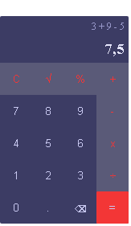

# Calculadora
<p align="center">Calculadora simples.</p>
<h4 align="center"> Status do projeto: completo</h4>

### Tabela de conteudo

<p align="center">
<a href="#funcionalidades">funcionalidades</a> • 
<a href="#Demostração-da-Aplicação">Demostração</a> • 
<a href="#Como-executar-o-projeto">como Executar</a> • 
<a href="#Tecnologias-utilizadas">Tecnologias</a> •   
<a href="#autor">Autor</a> •
<a href="#licenc-a">Licença</a> 
</p>

### funcionalidades

- [x] operações básicas
- [x] histórico simples de conta e resposta
- [x] mais de uma operação por vez
- [x] refatorar o codigo
- [x] testes unitários
- [x] script type module


### Demostração da Aplicação
<br>
<a href="https://bsantuz.github.io/calculator/">Teste a aplicação<a>

[


### Como executar o projeto
Antes de começar, você vai precisar ter instalado em sua máquina um editor para trabalhar com o código como [VSCode](https://code.visualstudio.com/)

```bash
# Clone este repositório
$ git clone <>


# Acesse a pasta do projeto no terminal/cmd
$ cd ...

# Instale as dependencias
$ npm install --save-dev jest
$ npm install --save-dev @babel/preset-env
$ npm i babel-jest

# Execute a aplicação 
$ index.html ou server live(plugin do vscode)

```
         

### Tecnologias utilizadas

* front end basic(html, css, js)
* babel
* jets
* sass

### Autor
Feito com ❤️ por Bruno Santuz 👋🏽 Entre em contato!

email: brunobruno2000@hotmail.com

### Licença
MIT License
